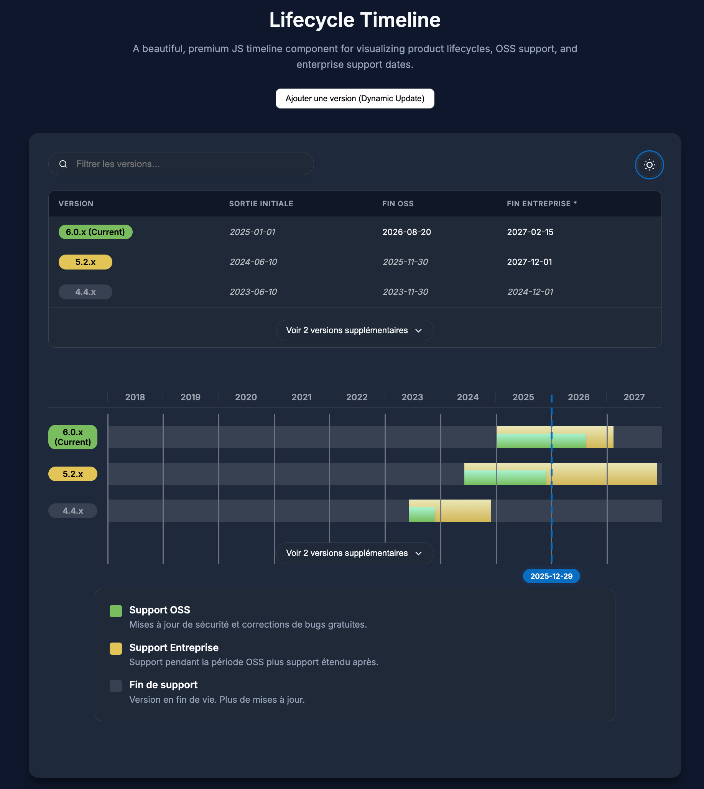

# 🕒 Lifecycle Timeline

A premium, interactive Vanilla JS component for visualizing product lifecycles, including OSS support, Enterprise support, and EOL (End-Of-Life) dates.


[**🚀 View Live Demo**](https://ericreboisson.github.io/lifecycle-timeline/)




## ✨ Features

- **Interactive Table**: A clear data table between the filter and tracks for quick reference.
- **Smart Filtering**: Real-time search to filter versions across both table and timeline.
- **Dark Mode**: Native support with a persistent toggle.
- **Rich Legend**: Detailed explanation of support states.
- **Responsive Design**: Works on all screen sizes with horizontal scroll support.
- **Sticky Labels**: Version names stay visible while scrolling through time.
- **Interactive Tooltips**: Detailed date information on hover.
- **Live Indicator**: Pulsing badge showing the current date line.
- **Fully Typed**: Includes TypeScript definitions out of the box.

## 🚀 Installation

### Via NPM
```bash
npm install lifecycle-timeline
```

### Manual Installation
Download the files from the `dist` folder: `timeline.js` (ESM), `timeline.umd.cjs` (UMD), and `timeline.css`.

## 🛠 Usage

### Modern JavaScript (ESM)
```javascript
import Timeline from 'lifecycle-timeline';
import 'lifecycle-timeline/style.css';

const data = [
  {
    version: "6.0.x",
    ossStart: "2025-01-01",
    ossEnd: "2026-08-20",
    enterpriseEnd: "2027-02-15",
    releaseNotesUrl: "https://example.com/notes"
  }
];

new Timeline('timeline-root', data, { visibleCount: 3 });
```

### Browser (UMD)
```html
<link rel="stylesheet" href="https://unpkg.com/lifecycle-timeline/dist/timeline.css">
<div id="timeline-root"></div>

<script src="https://unpkg.com/lifecycle-timeline/dist/timeline.umd.cjs"></script>
<script>
  const data = [...];
  new Timeline('timeline-root', data);
</script>
```

## ⚙️ Configuration & API

### Constructor
`new Timeline(elementId, data, options)`

#### `options` Object

| Property | Type | Default | Description |
| :--- | :--- | :--- | :--- |
| `visibleCount` | `number` | `3` | Initial versions shown before "Show More" appears. |
| `locale` | `string` | `auto` | UI language (`'en'`, `'fr'`). |
| `i18n` | `object` | `{}` | Custom translations or new languages. |
| `showTable` | `boolean` | `true` | Shows/hides the summary data table. |

### 🌐 Internationalization (i18n)

You can easily override existing labels or add new languages:

```javascript
new Timeline('timeline-root', data, {
  locale: 'fr',
  i18n: {
    fr: {
      filter: "Rechercher une version...",
      more: "Afficher {n} de plus"
    }
  }
});
```

### 🛡️ Data Validation
The component automatically validates your data. If required fields (`version`, `ossStart`, `ossEnd`) are missing or if date formats are invalid, a warning is logged in the browser console.

## 🎨 Theming
The component uses CSS variables for easy customization:
```css
:root {
  --accent-oss: #99e67d;     /* Community support color */
  --accent-ent: #ffe88e;     /* Enterprise support color */
  --current-date: #086dc3;   /* Today's indicator color */
}
```

## 🧪 Testing
We use **Vitest** for unit testing.
```bash
npm test
```

## 🛠 Development
1. `npm install`
2. `npm run dev`
3. `npm run build`
4. `npm run release` (Build + Publish)

## 📄 License
MIT © Eric REBOISSON
